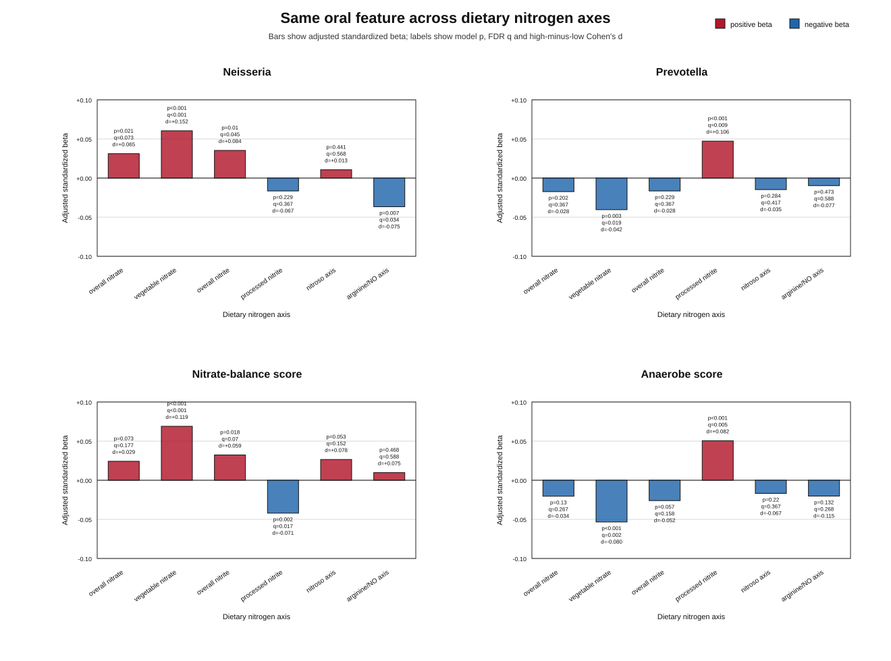

# Agentic diet reconstruction reveals divergent oral nitrate-cycle ecologies linked to vegetable nitrate and processed nitrite in the Human Phenotype Project

**Article type:** Article  
**Target journal style:** Nature Communications  
**Status:** working manuscript draft from de-identified TRE summary exports  
**Core framing:** observational, food-source-specific nitrogen ecology, agentic human-in-the-loop diet reconstruction  

## Abstract

Dietary nitrate and nitrite are chemically related exposures, but they occur in distinct food matrices and may enter nitrate-nitrite-nitric oxide biology through different ecological routes. Population-scale tests of these source-specific nitrogen axes are limited by sparse diet annotation and incomplete chemical resolution. Here we used an agentic, human-in-the-loop workflow to query an enhanced food knowledge graph and reconstruct nitrogen-related dietary axes in the Human Phenotype Project. Among reliable diet loggers with oral metagenomic profiles, vegetable nitrate was associated with higher oral nitrate-balance score, higher Neisseria abundance and lower anaerobe-associated ecology. Processed nitrite showed a divergent pattern, including higher anaerobe score, Prevotella and Megasphaera, and lower nitrate-balance score. The same oral features often increased under one nitrogen axis and decreased under another, and processed nitrite associations were not explained by a nitroso-axis mediation model. These findings do not establish causality or isolate nitrate ion dose from food-source context. They show that agentic diet reconstruction can separate habitual nitrogen-related dietary axes into distinct oral microbial ecology signatures in a large free-living cohort.

## Introduction

The oral microbiome is a biochemical gatekeeper of the enterosalivary nitrate-nitrite-nitric oxide pathway. Dietary nitrate is absorbed systemically, concentrated into saliva and reduced by oral bacteria to nitrite. This nitrite can contribute to nitric oxide availability in the acidic stomach and peripheral tissues. Human nitrate-intervention studies have repeatedly implicated oral nitrate-reducing communities, including taxa such as Neisseria and Rothia, in this pathway. These studies provide a mechanistic foundation for linking diet, oral ecology and host physiology.

However, free-living diets do not expose individuals to nitrate and nitrite as isolated ions. Nitrate-enriched vegetables, nitrite-preserved processed meats, nitroso-associated foods and arginine-rich foods differ in fibre, protein, salt, processing, cooking chemistry and broader behavioural context. Treating all nitrogen-related exposures as one axis risks mixing biologically distinct food-source routes. Conversely, treating foods only as broad categories can miss chemical structure that is relevant to oral microbial ecology.

This creates a practical bottleneck for large-scale diet-microbiome discovery. Diet logs are usually recorded as foods, dishes or ingredients, while microbial and metabolic hypotheses are often expressed as chemicals, pathways or organism-level mechanisms. A food knowledge graph can bridge these levels by connecting food items to compounds, chemical classes and metabolic concepts. Yet deciding which KG-derived links define a useful exposure axis remains a scientific judgement problem, especially when food source and biochemical annotation both matter.

We therefore used an agentic diet reconstruction workflow in which an AI agent queried an enhanced food knowledge graph, proposed nitrogen-related dietary axes, inspected intermediate outputs and worked with a human analyst to refine source-specific definitions. The human-in-the-loop component was essential: the analysis aimed to distinguish vegetable nitrate from processed nitrite and nitroso-associated foods while avoiding overclaiming isolated chemical causality. We then tested whether these reconstructed axes were associated with prespecified oral microbiome ecology features in the Human Phenotype Project (HPP), a deeply phenotyped cohort with diet logs and oral metagenomic profiling.

The central question was whether chemically adjacent but source-distinct dietary nitrogen axes map to the same oral microbiome pattern or to divergent ecological states. Our results support the latter. Vegetable nitrate and processed nitrite were associated with different, sometimes opposite, oral nitrate-cycle ecologies. The paper should therefore be read as a population-scale reconstruction and disambiguation study: it recovers known nitrate-sensitive oral microbiome biology while showing that source-aware nitrogen axes are not interchangeable in habitual diet data.

## Results

### Agentic knowledge-graph reconstruction defined source-specific nitrogen axes

We reconstructed six nitrogen-related diet axes from the enhanced food knowledge graph: overall nitrate, vegetable nitrate, overall nitrite, processed nitrite, nitroso axis and arginine/NO axis. Each axis connected chemical or metabolic concepts to HPP food nodes and was converted to participant-level exposure from diet-logging events. The main exposure metric was grams of connected foods per 1000 g of logged intake. Sparse or irregular diet loggers were excluded before the primary analysis.

The primary model adjusted for age, sex, BMI, current smoking status and alcohol frequency. A secondary analysis added diet-logging covariates and produced broadly stable conclusions. Because the exposure variables are reconstructed from KG-connected foods, they should be interpreted as food-source nitrogen axes rather than direct measurements of nitrate or nitrite dose.

**Table 1. Reconstructed diet axes used in the main analysis**

| Axis | KG terms/source rule | Connected foods after filtering | Excluded sparse/irregular loggers | Primary metric |
|---|---:|---:|---:|---|
| Overall nitrate | nitrate, non-metal nitrates, sodium nitrate, potassium nitrate | 3,848 | 2,567 | exposure per 1000 g logged |
| Vegetable nitrate | nitrate terms plus vegetable-source filter | 209 | 2,567 | exposure per 1000 g logged |
| Overall nitrite | nitrite, non-metal nitrites, sodium nitrite, potassium nitrite | 3,262 | 2,567 | exposure per 1000 g logged |
| Processed nitrite | nitrite/nitrate terms plus processed/cured-source filter | 57 | 2,567 | exposure per 1000 g logged |
| Nitroso axis | nitroso, nitrosamine, N-nitroso and related terms | 2,780 | 2,567 | exposure per 1000 g logged |
| Arginine/NO axis | arginine, citrulline, ornithine and nitric-oxide-related pathway terms | 7,405 | 2,567 | exposure per 1000 g logged |

**Figure 1.** Adjusted standardized beta values for prespecified oral ecology outcomes across six reconstructed dietary nitrogen axes. Asterisks indicate associations passing FDR q < 0.05 within the prespecified outcome family.

### Broad nitrate and nitrite axes provided a bridge between chemistry and food source

We first examined the broad overall nitrate and overall nitrite axes to ask whether the signal was restricted to manually source-filtered vegetable and processed-food definitions. Overall nitrate showed weaker but directionally consistent associations with several oral ecology features, including higher Burkholderiaceae, higher Neisseria and higher nitrate-balance score, with lower Moraxellaceae and anaerobe score. Overall nitrite showed a similar broad pattern for Burkholderiaceae and Neisseria and a positive direction for nitrate-balance score, while maintaining lower anaerobe and Moraxellaceae directions.

These broad axes are important because they reduce the interpretation that the result is only a vegetable-versus-processed-meat contrast. They show that KG-derived nitrate and nitrite annotations contain oral ecology signal even before the more restrictive source-specific filters are applied. However, the broad axes are heterogeneous: they mix foods from multiple matrices and therefore produce smaller, less specific effects than the source-aware vegetable nitrate and processed nitrite axes.

### Vegetable nitrate aligned with nitrate-positive oral ecology

Higher vegetable nitrate exposure was associated with a higher oral nitrate-balance score, higher Neisseria abundance and higher nitrate-positive score. It was also associated with a lower anaerobe score and lower Veillonella and Prevotella abundance. The Neisseria signal was consistent across genus, species and family-level summaries, supporting a coherent taxonomic pattern rather than a single-feature artifact.

These results are directionally consistent with prior nitrate-intervention studies, but the novelty here is not the existence of nitrate-responsive oral taxa. The contribution is that a KG-enhanced, agentic workflow recovered this biology from habitual diet logs in a large free-living cohort and separated it from related processed-food and nitroso-associated axes.

### Processed nitrite showed a divergent oral ecology signature

Processed nitrite was not associated with the same ecology pattern as vegetable nitrate. Instead, higher processed nitrite exposure was associated with higher anaerobe score, higher Prevotella and Megasphaera, and lower nitrate-balance score. This divergence is central to the paper because it argues against a one-dimensional “more nitrate/nitrite” interpretation. In HPP diet logs, broad nitrate and nitrite axes showed detectable oral ecology signal, while source-specific nitrogen reconstruction sharpened the contrast between vegetable nitrate and processed nitrite.

**Table 2. Selected adjusted associations supporting divergent oral ecology**

| Axis | Oral feature | n | Standardized beta | FDR q | High-minus-low Cohen's d | Interpretation |
|---|---:|---:|---:|---:|---:|---|
| Overall nitrate | Burkholderiaceae | 5,689 | +0.040 | 0.0188 | +0.090 | Broad nitrate-linked ecology signal |
| Overall nitrate | Neisseria | 5,689 | +0.031 | 0.0731 | +0.065 | Directionally matches vegetable nitrate |
| Overall nitrate | Anaerobe score | 5,691 | -0.020 | 0.267 | -0.034 | Directionally lower anaerobe ecology |
| Vegetable nitrate | Nitrate-balance score | 5,691 | +0.068 | 5.4e-5 | +0.119 | Higher nitrate-cycle balance |
| Vegetable nitrate | Neisseria | 5,689 | +0.059 | 3.1e-4 | +0.152 | Higher nitrate-reducer-associated taxon |
| Vegetable nitrate | Nitrate-positive score | 5,691 | +0.046 | 0.0088 | +0.083 | Higher nitrate-positive ecology |
| Vegetable nitrate | Anaerobe score | 5,691 | -0.052 | 0.0024 | -0.080 | Lower anaerobe-associated ecology |
| Vegetable nitrate | Veillonella | 5,689 | -0.044 | 0.0095 | -0.084 | Lower Veillonella abundance |
| Vegetable nitrate | Prevotella | 5,689 | -0.040 | 0.0188 | -0.042 | Lower Prevotella abundance |
| Overall nitrite | Burkholderiaceae | 5,689 | +0.038 | 0.0245 | +0.079 | Broad nitrite-linked ecology signal |
| Overall nitrite | Neisseria | 5,689 | +0.035 | 0.0450 | +0.084 | Directionally matches nitrate-positive ecology |
| Overall nitrite | Nitrate-balance score | 5,691 | +0.032 | 0.0701 | +0.059 | Directionally higher nitrate-cycle balance |
| Processed nitrite | Anaerobe score | 5,691 | +0.049 | 0.0052 | +0.082 | Higher anaerobe-associated ecology |
| Processed nitrite | Prevotella | 5,689 | +0.046 | 0.0088 | +0.106 | Higher Prevotella abundance |
| Processed nitrite | Megasphaera | 5,689 | +0.043 | 0.0117 | +0.091 | Higher Megasphaera abundance |
| Processed nitrite | Nitrate-balance score | 5,691 | -0.041 | 0.0169 | -0.071 | Lower nitrate-cycle balance |
| Arginine/NO axis | Neisseria | 5,689 | -0.036 | 0.0338 | -0.075 | Distinct from vegetable nitrate pattern |

### The same oral features moved in opposite directions across nitrogen axes

The clearest visualization of the result is not a single exposure-outcome association, but the contrast across chemically related axes. Oral nitrate-balance score increased under vegetable nitrate and was directionally positive under overall nitrate and overall nitrite, but decreased under processed nitrite. Neisseria increased under vegetable nitrate, overall nitrate and overall nitrite, but decreased under the arginine/NO axis. Anaerobe score and Prevotella showed the opposite configuration: they increased under processed nitrite and decreased under vegetable nitrate and the broad overall axes.

This “same feature, opposite axis” result is the main publication signal. It gives the manuscript a sharper ecological message than a list of significant associations: chemically adjacent nitrogen-related diets are linked to separable oral microbial states.

**Figure 2.** Oral features with positive associations under at least one nitrogen-related dietary axis and negative associations under another. Bars show the strongest positive and strongest negative adjusted standardized beta for each feature.

**Figure 3.** Feature-level examples showing how the same oral ecology feature changes across all reconstructed nitrogen axes. Bars show adjusted standardized beta values for each axis. Labels report model p values, FDR q values and high-minus-low Cohen's d. Neisseria and nitrate-balance score show nitrate-positive patterns, while Prevotella and anaerobe score illustrate the opposing processed-nitrite-associated ecology.

**Figure 4.** Mean oral ecology features across low, mid and high exposure tertiles for representative associations. Error bars show 95% confidence intervals from de-identified group summaries.

### Nitroso-associated diet did not statistically mediate processed nitrite associations

Processed nitrite occurs in food contexts that can be nitrosation-prone, so we tested whether processed nitrite associations were explained by the reconstructed nitroso axis. In prespecified oral ecology outcomes, the indirect processed nitrite to nitroso axis to oral ecology signal was not supported after FDR correction. The minimum indirect q value was 0.728 in the main analysis, with no indirect test passing q < 0.05 or q < 0.10.

This result should be interpreted carefully. It does not show that nitrosation chemistry is irrelevant. It shows that, in the reconstructed HPP diet axes used here, processed nitrite and nitroso-associated diet should not be collapsed into a simple mediation model. They are better presented as separable source-aware dietary axes.

### Age and sex structure diet and oral ecology but are secondary to the axis-divergence result

Age and sex were associated with reconstructed diet axes and with oral ecology features. Older participants had higher reconstructed vegetable nitrate exposure, while sex was associated with vegetable nitrate, processed nitrite and nitroso-axis exposure. Age and sex were also associated with oral features including Neisseria, Shannon diversity, anaerobe score and Burkholderiaceae.

These results provide context and motivate covariate adjustment, but they are not the central claim of this manuscript. The primary message is not that age or sex mediates diet-microbiome associations. Rather, demographic structure exists in the cohort while the source-specific nitrogen-axis associations remain the main ecological observation.

**Table 3. Selected demographic associations with reconstructed dietary axes**

| Demographic | Diet axis | n | Standardized beta | FDR q | Interpretation |
|---|---:|---:|---:|---:|---|
| Age | Vegetable nitrate | 5,691 | +0.104 | 9.4e-14 | Older participants had higher reconstructed vegetable nitrate exposure |
| Sex | Vegetable nitrate | 5,691 | +0.085 | 2.0e-9 | Vegetable nitrate differed by sex coding |
| Sex | Processed nitrite | 5,691 | -0.083 | 2.2e-9 | Processed nitrite differed by sex coding |
| Sex | Nitroso axis | 5,691 | +0.077 | 2.7e-8 | Nitroso-associated diet differed by sex coding |
| Age | Processed nitrite | 5,691 | -0.054 | 1.4e-4 | Processed nitrite differed by age |

**Figure 5.** Selected age and sex associations with oral ecology. These associations are reported as cohort structure and adjustment context.

## Discussion

In this large HPP analysis, agentic KG-enhanced diet reconstruction separated chemically related nitrogen exposures into distinct oral microbiome ecology signatures. Broad overall nitrate and nitrite axes contained detectable oral ecology signal, particularly for Burkholderiaceae and Neisseria, suggesting that the finding is not restricted to a single vegetable-versus-meat contrast. Source-aware reconstruction then sharpened this pattern: vegetable nitrate was associated with a nitrate-positive ecology marked by higher nitrate-balance score and Neisseria abundance and lower anaerobe-associated features, while processed nitrite showed higher Prevotella, Megasphaera and anaerobe score and lower nitrate-balance score.

The findings are biologically plausible but should not be overstated. Nitrate-sensitive oral taxa have been described before in intervention studies, and vegetable-rich dietary patterns are already known to differ from processed-meat-rich patterns. The advance here is therefore not a claim that a specific bacterium was newly discovered as nitrate responsive. The advance is methodological and ecological: an agentic, human-guided reconstruction of free-living diet logs recovered nitrate-cycle biology at cohort scale and showed that vegetable nitrate, processed nitrite, nitroso-associated diet and arginine/NO-related axes do not map to a single oral microbial gradient.

This distinction matters because nitrate and nitrite are often discussed as chemically adjacent exposures. In biological systems, however, route and matrix can change interpretation. Vegetable nitrate is linked to an enterosalivary pathway in which oral bacteria reduce salivary nitrate to nitrite. Processed nitrite reflects direct ingestion of nitrite-containing foods in matrices that differ in protein, salt, processing and cooking chemistry. Our HPP results are consistent with the idea that these dietary axes are separable in oral ecology, but they do not prove that nitrate or nitrite ions themselves are responsible for the associations.

The strongest reviewer challenge is that the result may reflect vegetable versus processed-food diet quality rather than nitrate/nitrite biology. We address this by framing the exposures as food-source nitrogen axes, using KG chemistry to define them, showing that broad overall nitrate and nitrite axes carry related oral ecology signal, and showing that the same oral features move in opposite directions across multiple reconstructed nitrogen axes. Nonetheless, submission should include additional sensitivity analyses where possible: vegetable nitrate adjusted for total vegetable intake or fibre, processed nitrite adjusted for processed meat, sodium, protein or saturated fat, and food-list audits using exact token matching. These analyses would help separate chemical annotation from broader dietary pattern.

The nitroso-axis analysis further clarifies the interpretation. Although processed nitrite can occur in nitrosation-prone contexts, the reconstructed nitroso axis did not statistically mediate processed nitrite associations with oral ecology. The safer conclusion is that processed nitrite and nitroso-associated diet are separable reconstructed axes, not that nitrosation biology is absent.

This study has several limitations. It is observational and cross-sectional with respect to the diet-microbiome associations analysed here. Diet exposures are reconstructed from logs and KG-connected foods rather than measured nitrate, nitrite or nitroso compounds. Oral microbiome features are compositional and sparse, and although the primary results use prespecified ecology outcomes with FDR correction, full compositional modelling would strengthen future versions. The agentic reconstruction process is also a source of flexibility; we therefore report the final axes, covariates, filters and sensitivity models transparently.

Despite these limitations, the study provides a useful template for microbiome-scale dietary discovery. Chemical knowledge graphs can convert diet logs into biologically motivated exposure axes. Human oversight can refine those axes into source-aware hypotheses. Large phenotype cohorts can then test whether the reconstructed exposures map to coherent microbial ecologies. For nitrate-cycle biology, this approach shows that vegetable nitrate and processed nitrite are best treated as distinct ecological exposures in population-scale oral microbiome analysis.

## Methods

### Study cohort and analysis environment

Analyses were performed inside the HPP TRE using participant-level diet and oral microbiome data. Only de-identified summary statistics, aggregate plotting tables and manuscript-ready figures were exported. Participant identifiers were not included in manuscript outputs.

### Agentic diet reconstruction workflow

We used an agentic, human-in-the-loop workflow to define nitrogen-related diet axes from an enhanced food knowledge graph. The agent queried chemical and pathway terms, inspected connected food nodes and proposed candidate exposure definitions. A human analyst reviewed these definitions, refined source filters and removed interpretations that would imply direct chemical measurement. This iterative process produced six final axes: overall nitrate, vegetable nitrate, overall nitrite, processed nitrite, nitroso axis and arginine/NO axis.

### Exposure scoring and diet logging reliability

Diet events were loaded in TRE through `PhenoLoader`. For each participant and exposure axis, grams of KG-connected foods were summed and normalized by total logged intake to produce exposure per 1000 g logged. This metric was chosen to reduce bias from participants who logged more total food while preserving true differences in amount and food choice. Diet logging reliability was assessed before analysis, and sparse or irregular loggers were excluded from the primary model.

### Oral microbiome preprocessing

Oral microbiome data were loaded using `PhenoLoader('oral_microbiome')`. MetaPhlAn genus, species and family abundance tables were used to construct prespecified ecology outcomes. These included Shannon diversity, nitrate-positive score, anaerobe score, nitrate-balance log ratio and selected taxa relevant to nitrate-cycle or oral ecology: Neisseria, Rothia, Prevotella, Veillonella, Megasphaera, Moraxellaceae and Burkholderiaceae. HUMAnN pathway outputs were explored and retained for supplementary development, but the main manuscript focuses on the more stable MetaPhlAn-derived panel.

### Statistical models

Primary diet-oral ecology associations were tested using adjusted linear models. The main model included age, sex, BMI, current smoking status and alcohol frequency. Associations are reported as standardized beta values, nominal p values and FDR-adjusted q values. High-versus-low exposure tertile summaries are reported using Cohen's d for interpretability. Secondary models with additional diet-logging covariates were used as sensitivity analyses.

### Multiple testing

FDR correction was applied within the prespecified oral ecology outcome family for the main analysis. Supplementary all-feature analyses were corrected separately across the larger taxonomic feature family. The manuscript tables emphasize the prespecified family to avoid mixing targeted ecology hypotheses with exploratory feature-wide discovery.

### Mediation-style analysis

We tested whether the processed nitrite to oral ecology associations were statistically attenuated by inclusion of the nitroso axis. This analysis was treated as exploratory mediation-style modelling rather than causal mediation. Lack of an indirect FDR signal was interpreted as evidence against a simple processed nitrite to nitroso axis to oral ecology explanation in these reconstructed variables.

### Reporting conventions

All directionality is observational. Positive standardized beta indicates higher oral feature values with higher exposure after covariate adjustment. High-minus-low Cohen's d indicates the difference in oral feature values between high and low exposure tertiles. The manuscript avoids causal language unless future intervention data are added.

## Data availability

Participant-level HPP data remain inside the TRE and are not distributed with this manuscript draft. The current draft was prepared from de-identified aggregate exports from `A_main_result_export_bundle.csv` and `B_secondary_result_export_bundle.csv`.

## Code availability

The analysis notebooks and manuscript-generation code are located in `depricated/nitrate_manual/`. Manuscript figures and tables were generated from de-identified summary exports using `build_nature_microbiology_package.py`.

## References to anchor the manuscript

1. The effects of nitrate on the oral microbiome: a systematic review investigating prebiotic potential. [PMC10901185](https://pmc.ncbi.nlm.nih.gov/articles/PMC10901185/).
2. The effect of dietary nitrate on the oral microbiome and salivary biomarkers in individuals with high blood pressure. [PMC11393165](https://pmc.ncbi.nlm.nih.gov/articles/PMC11393165/).
3. Nitrate-responsive oral microbiome modulates nitric oxide homeostasis and blood pressure in humans. [PMC6191927](https://pmc.ncbi.nlm.nih.gov/articles/PMC6191927/).
4. Network analysis of nitrate-sensitive oral microbiome reveals interactions with cognitive function and cardiovascular health across dietary interventions. [PMC7970425](https://pmc.ncbi.nlm.nih.gov/articles/PMC7970425/).

## Internal reviewer-risk checklist

- Add exact TRE food-list audit for each reconstructed axis before submission.
- Use word-boundary matching for processed/cured source filters to avoid substring artefacts.
- Add source-matched sensitivity models where possible: vegetable nitrate adjusted for total vegetables/fibre; processed nitrite adjusted for processed meat, sodium, protein and saturated fat.
- Keep the claim at the level of food-source nitrogen ecology unless measured nitrate, nitrite or nitroso biomarkers are added.
- Avoid causal language in title, abstract and figure legends.
