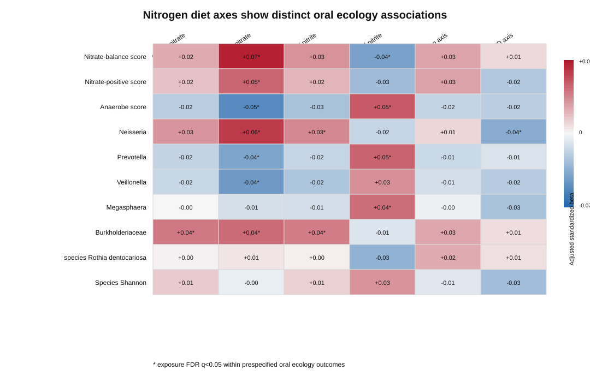
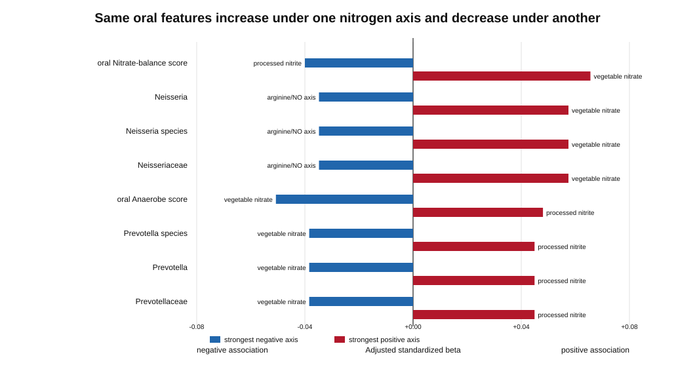
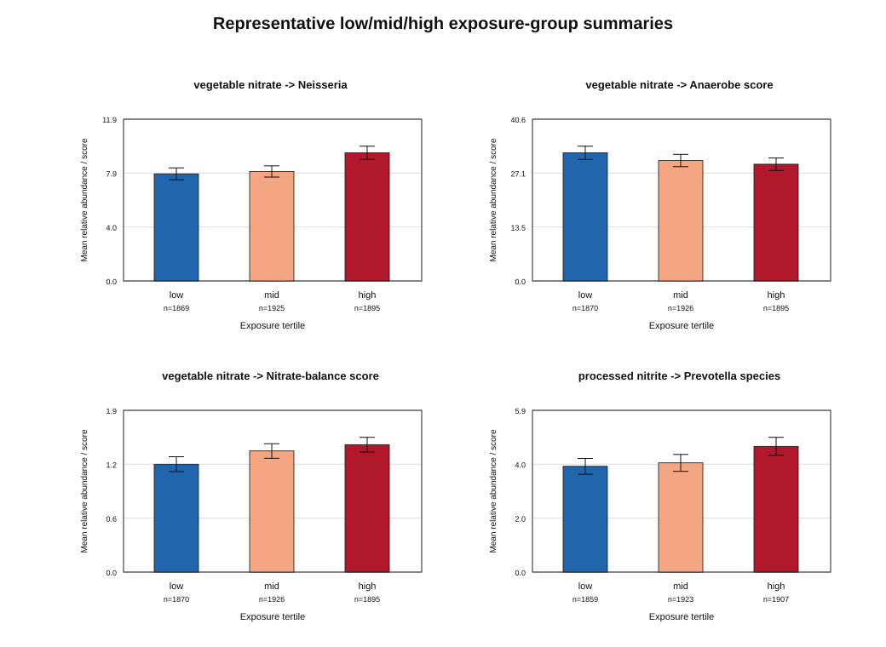
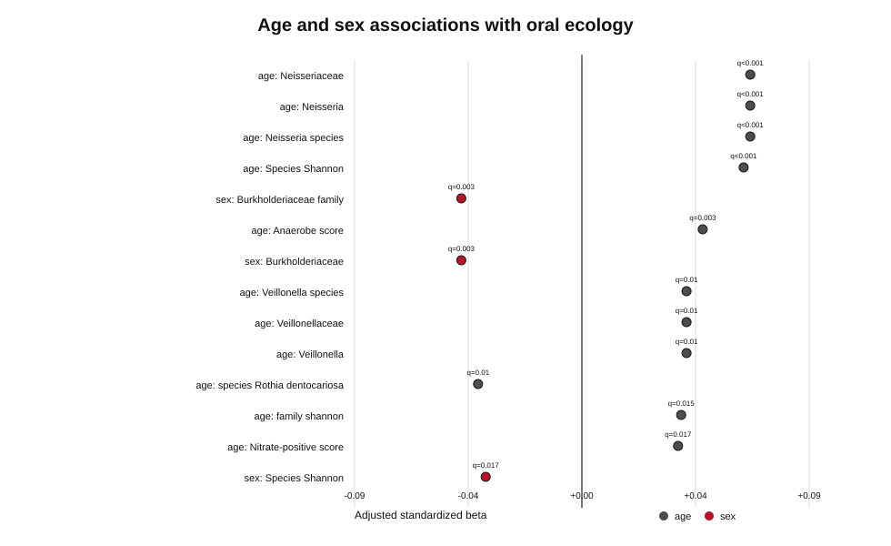

# Agentic diet reconstruction reveals divergent oral nitrate-cycle ecologies linked to vegetable nitrate and processed nitrite in the Human Phenotype Project

**Draft manuscript for Nature Microbiology-style development**  
**Status:** working draft based on de-identified TRE summary exports from `Nitrate_results_1`  
**Recommended framing:** observational, association-based, food-source-specific nitrogen ecology  

## Abstract

Dietary nitrate and nitrite are chemically adjacent exposures, but they occur in different food matrices and enter nitrate-nitrite-nitric oxide biology through different ecological routes. Human studies of nitrate supplementation have shown reproducible changes in oral nitrate-reducing communities, but most evidence comes from small interventions or targeted dietary contrasts. Here we used an agentic, human-in-the-loop diet reconstruction workflow to query an enhanced food knowledge graph and define six nitrogen-related dietary axes in the Human Phenotype Project: overall nitrate, vegetable nitrate, overall nitrite, processed nitrite, nitroso-associated foods and arginine/NO substrates. Among reliable diet loggers with oral metagenomic profiles, vegetable nitrate was associated with a higher oral nitrate-balance score, higher Neisseria abundance and lower anaerobe-associated oral ecology. Processed nitrite showed a distinct pattern, including higher anaerobe score and higher Prevotella and Megasphaera abundance, while the nitroso-associated axis did not explain the processed nitrite association pattern. These results do not establish causality and do not isolate nitrate ion dose from food-source context. Instead, they show that agentic reconstruction of large-scale diet logs can recover known nitrate-sensitive oral microbiome biology and separate vegetable- and processed-food nitrogen axes into divergent oral ecological signatures in a free-living human cohort.

## Main

The oral microbiome is central to the enterosalivary nitrate-nitrite-nitric oxide pathway. Dietary nitrate is absorbed, concentrated in saliva and reduced by oral bacteria to nitrite, which can contribute to nitric oxide availability. Prior intervention studies have shown that nitrate exposure can increase taxa such as Neisseria and Rothia and reduce Prevotella and Veillonella, with links to salivary biomarkers and vascular physiology. However, real-world diets do not expose individuals to isolated nitrate or nitrite. Nitrate-enriched vegetables, nitrite-containing processed meats, nitroso-associated foods and arginine-rich foods differ not only chemically but also by food matrix, processing, salt, protein, fibre and broader lifestyle correlates.

This creates a practical problem for population-scale diet-microbiome discovery. Standard diet variables often collapse chemically related exposures or treat foods only as broad categories. We therefore used an agentic diet-data enhancement strategy in which a full food knowledge graph was queried for chemical and metabolic nodes, candidate food sets were reconstructed from KG paths, and a human analyst iteratively refined source-specific axes. The aim was not to claim that nitrate or nitrite alone causes oral microbiome differences. The aim was to test whether chemically informed and source-aware diet axes map to distinguishable oral ecology states in a large free-living cohort.

### Agentic reconstruction of nitrogen-related diet axes

The analysis used the full enhanced food knowledge graph to define six dietary axes. Each axis was converted into a participant-level exposure score from diet-logging events, normalized as grams of connected foods per 1000 g of logged intake. Sparse or irregular diet loggers were excluded before the primary analysis. The main model adjusted for age, sex, BMI, current smoking status and alcohol frequency.

**Table 1. Reconstructed diet axes used in the main analysis**

| Axis | KG terms | Connected foods after filtering | Excluded sparse/irregular loggers | Primary metric |
|---|---:|---:|---:|---|
| Overall nitrate | nitrate, non-metal nitrates, sodium nitrate, potassium nitrate | 3,848 | 2,567 | exposure per 1000 g logged |
| Vegetable nitrate | nitrate, non-metal nitrates + vegetable-source filter | 209 | 2,567 | exposure per 1000 g logged |
| Overall nitrite | nitrite, non-metal nitrites, sodium nitrite, potassium nitrite | 3,262 | 2,567 | exposure per 1000 g logged |
| Processed nitrite | nitrite/nitrate terms + processed/cured-source filter | 57 | 2,567 | exposure per 1000 g logged |
| Nitroso axis | nitroso, nitrosamine, N-nitroso, nitroso compound | 2,780 | 2,567 | exposure per 1000 g logged |
| Arginine/NO axis | arginine, citrulline, ornithine, arginine/proline metabolism, nitric oxide | 7,405 | 2,567 | exposure per 1000 g logged |

This axis construction should be interpreted as food-source-specific nitrogen reconstruction, not as direct measurement of nitrate or nitrite dose. The vegetable nitrate and processed nitrite axes intentionally combine chemical links with food-source filters. This is a strength for source-aware ecology, but a limitation for isolated chemical attribution.

**Figure 1.** Adjusted standardized beta values for prespecified oral ecology outcomes across six reconstructed dietary nitrogen axes. Asterisks mark exposure associations passing FDR q < 0.05 within the prespecified outcome family.

### Vegetable nitrate and processed nitrite map to divergent oral ecology

Vegetable nitrate showed the clearest association pattern. Higher vegetable nitrate was linked to a higher nitrate-balance score, higher Neisseria abundance, higher nitrate-positive score, and lower anaerobe score. It was also linked to lower Veillonella and Prevotella. Processed nitrite showed a different pattern, including higher anaerobe score, higher Prevotella and Megasphaera, and lower nitrate-balance score. These patterns were stable in the secondary notebook with additional diet-logging covariates.

**Table 2. Selected adjusted associations supporting divergent oral ecology**

| Axis | Oral feature | n | Standardized beta | FDR q | High-minus-low Cohen's d | Interpretation |
|---|---:|---:|---:|---:|---:|---|
| Vegetable nitrate | Nitrate-balance score | 5,691 | +0.068 | 5.4e-5 | +0.119 | Higher nitrate-cycle balance |
| Vegetable nitrate | Neisseria | 5,689 | +0.059 | 3.1e-4 | +0.152 | Higher nitrate-reducer-associated taxon |
| Vegetable nitrate | Nitrate-positive score | 5,691 | +0.046 | 0.0088 | +0.083 | Higher prespecified nitrate-positive ecology |
| Vegetable nitrate | Anaerobe score | 5,691 | -0.052 | 0.0024 | -0.080 | Lower anaerobe-associated ecology |
| Vegetable nitrate | Veillonella | 5,689 | -0.044 | 0.0095 | -0.084 | Lower Veillonella abundance |
| Vegetable nitrate | Prevotella | 5,689 | -0.040 | 0.0188 | -0.042 | Lower Prevotella abundance |
| Processed nitrite | Anaerobe score | 5,691 | +0.049 | 0.0052 | +0.082 | Higher anaerobe-associated ecology |
| Processed nitrite | Prevotella | 5,689 | +0.046 | 0.0088 | +0.106 | Higher Prevotella abundance |
| Processed nitrite | Megasphaera | 5,689 | +0.043 | 0.0117 | +0.091 | Higher Megasphaera abundance |
| Processed nitrite | Nitrate-balance score | 5,691 | -0.041 | 0.0169 | -0.071 | Lower nitrate-cycle balance |
| Arginine/NO axis | Neisseria | 5,689 | -0.036 | 0.0338 | -0.075 | Distinct from vegetable nitrate pattern |

The same oral features often had opposite directions across dietary nitrogen axes. This was most apparent for the nitrate-balance score, Neisseria, anaerobe score and Prevotella. These are the most important results for the paper because they show that the reconstruction does not simply produce a one-dimensional “more nitrogen” signal.

**Figure 2.** Oral features with positive associations under at least one nitrogen-related dietary axis and negative associations under another. Bars show the strongest positive and strongest negative adjusted standardized beta for each feature.

**Figure 3.** Mean oral ecology features across low, mid and high exposure tertiles for representative associations. Error bars show 95% confidence intervals from de-identified group summaries.

### Nitroso-associated diet did not explain the processed nitrite pattern

Because processed nitrite may occur in nitrosation-prone food matrices, we tested whether the processed nitrite association pattern was statistically explained by the reconstructed nitroso axis. In the prespecified oral ecology outcomes, the indirect processed nitrite -> nitroso axis -> oral ecology signal was not supported after FDR correction. The minimum indirect q value was 0.728 in the main analysis, with zero indirect tests passing q < 0.05 or q < 0.10. This argues against presenting nitroso axis as a mediator in these data. The safer interpretation is that processed nitrite and nitroso-associated diet are separable reconstructed dietary axes with only weak evidence for a simple mediation structure.

### Demographic structure is present but secondary

Age and sex were associated with both dietary axes and oral ecology, but these results are secondary to the diet-axis ecology story. Age and sex differences in vegetable nitrate and processed nitrite intake were detectable after adjustment. Oral ecology also differed by age and sex, especially for Neisseria, Shannon diversity, anaerobe score and Burkholderiaceae. However, the main diet-axis associations were not best interpreted as age- or sex-specific causal pathways.

**Table 3. Selected demographic associations with reconstructed dietary axes**

| Demographic | Diet axis | n | Standardized beta | FDR q | Interpretation |
|---|---:|---:|---:|---:|---|
| Age | Vegetable nitrate | 5,691 | +0.104 | 9.4e-14 | Older participants had higher reconstructed vegetable nitrate exposure |
| Sex | Vegetable nitrate | 5,691 | +0.085 | 2.0e-9 | Vegetable nitrate differed by sex coding |
| Sex | Processed nitrite | 5,691 | -0.083 | 2.2e-9 | Processed nitrite differed by sex coding |
| Sex | Nitroso axis | 5,691 | +0.077 | 2.7e-8 | Nitroso-associated diet differed by sex coding |
| Age | Processed nitrite | 5,691 | -0.054 | 1.4e-4 | Processed nitrite differed by age |

**Figure 4.** Selected age and sex associations with oral ecology. These results are included as context and adjustment rationale rather than as the central claim.

## Discussion

This analysis suggests that large-scale, chemically informed diet reconstruction can recover and extend nitrate-sensitive oral microbiome patterns in a free-living cohort. The strongest signal was not a generic nitrate/nitrite gradient. Instead, vegetable nitrate and processed nitrite were associated with divergent oral ecology signatures. Vegetable nitrate aligned with higher nitrate-balance and Neisseria abundance and lower anaerobe-associated features. Processed nitrite aligned with higher Prevotella, Megasphaera and anaerobe score and lower nitrate-balance.

The taxonomic direction of the vegetable nitrate result is not biologically unprecedented. Prior nitrate supplementation and leafy-green vegetable studies have reported increases in nitrate-associated taxa such as Neisseria and Rothia and reductions in Prevotella and Veillonella. The contribution here is different: an agentic knowledge-graph workflow recovered this biology from large-scale habitual diet logs and separated it from processed nitrite, nitroso-associated and arginine/NO dietary axes. This makes the result a scale, reconstruction and disambiguation finding rather than a claim of discovering nitrate-sensitive oral taxa for the first time.

Several limitations are important. First, the exposure axes are reconstructed from KG-connected foods and diet logs, not direct measurements of nitrate, nitrite or nitroso compounds. Second, vegetable nitrate and processed nitrite are partly food-source definitions; therefore, they may capture broader dietary patterns such as vegetable intake, processed meat intake, salt, fibre, protein, food processing, oral hygiene or unmeasured health behaviours. Third, the oral microbiome outcomes are compositional and sparse, and the present summary analysis does not replace full compositional modelling. Fourth, observational associations cannot determine whether diet preceded microbiome differences, whether microbiome differences shaped diet, or whether both reflected unmeasured behavioural structure.

These limitations also define the next validation step. A stronger biological test would compare high- versus low-nitrate vegetables, processed meats with versus without nitrite, and source-matched controls. If HPP contains salivary nitrate/nitrite, blood pressure, oral health or metabolomics phenotypes, the most valuable extension would test whether the vegetable nitrate oral ecology signature aligns with nitrate-cycle biomarkers more strongly than generic vegetable intake or processed-food intake. In intervention settings, matched-dose designs comparing green leafy vegetables, potassium nitrate, nitrite-preserved processed foods and nitrite-free processed foods would be needed to separate nitrate chemistry from food matrix.

## Methods Summary

### Study design

We performed an observational analysis of diet logs, enhanced food knowledge graph annotations and oral metagenomic profiles from the Human Phenotype Project. The analysis used de-identified participant-level features inside the TRE and exported only summary statistics and aggregate plotting tables.

### Agentic, human-in-the-loop exposure reconstruction

An agentic workflow proposed nitrogen-related dietary axes from the full enhanced food knowledge graph. The human analyst reviewed chemical terms, food-source filters and preliminary plots, then iteratively refined prespecified axes. The final main axes were overall nitrate, vegetable nitrate, overall nitrite, processed nitrite, nitroso axis and arginine/NO axis. KG traversal used a maximum of four hops from chemical or pathway terms to HPP food nodes. Vegetable nitrate and processed nitrite applied source-specific food-name filters.

### Diet exposure scoring

Diet events were loaded inside TRE using `PhenoLoader`. Participant exposure was calculated from grams of KG-connected foods and normalized as exposure per 1000 g of logged food. Diet logging quality was assessed before analysis. The primary analysis retained reliable diet loggers and excluded sparse or irregular loggers.

### Oral microbiome preprocessing

Oral microbiome data were loaded using `PhenoLoader('oral_microbiome')`. MetaPhlAn genus, species and family abundance tables were used to construct prespecified taxa and ecology outcomes, including Neisseria, Rothia, Prevotella, Veillonella, Megasphaera, Moraxellaceae, Burkholderiaceae, Shannon diversity, nitrate-positive score, anaerobe score and nitrate-balance log ratio. HUMAnN pathway-derived nitrogen features were explored but the main manuscript emphasizes the more stable MetaPhlAn ecology panel.

### Statistical analysis

Primary models tested each diet axis against each prespecified oral ecology outcome using adjusted linear models. The main covariates were age, sex, BMI, current smoking status and alcohol frequency. A secondary analysis additionally included diet-logging covariates. FDR correction was applied within the prespecified oral ecology test family. Supplementary all-species analyses were corrected separately across the larger species-wide hypothesis family.

### Reporting conventions

All associations are reported as adjusted standardized beta values and FDR-adjusted q values. High-minus-low Cohen's d is reported for exposure tertile contrasts. Directional language is descriptive only.

## Data Availability

Participant-level HPP data remain inside TRE and were not exported. This draft uses de-identified aggregate outputs from `A_main_result_export_bundle.csv` and `B_secondary_result_export_bundle.csv`.

## Code Availability

The working notebooks are in `depricated/nitrate_manual/`. The manuscript figures and tables were generated from de-identified summary exports using `build_nature_microbiology_package.py`.

## References To Anchor The Introduction

1. The effects of nitrate on the oral microbiome: a systematic review investigating prebiotic potential. [PMC10901185](https://pmc.ncbi.nlm.nih.gov/articles/PMC10901185/).
2. The effect of dietary nitrate on the oral microbiome and salivary biomarkers in individuals with high blood pressure. [PMC11393165](https://pmc.ncbi.nlm.nih.gov/articles/PMC11393165/).
3. Nitrate-responsive oral microbiome modulates nitric oxide homeostasis and blood pressure in humans. [PMC6191927](https://pmc.ncbi.nlm.nih.gov/articles/PMC6191927/).
4. Network analysis of nitrate-sensitive oral microbiome reveals interactions with cognitive function and cardiovascular health across dietary interventions. [PMC7970425](https://pmc.ncbi.nlm.nih.gov/articles/PMC7970425/).

## Reviewer-Risk Notes For Internal Use

- Do not claim isolated nitrate or nitrite dose. The current variables are reconstructed food-source nitrogen axes.
- Do not claim causality or mediation. Processed nitrite -> nitroso axis -> oral ecology was not supported as a mediation result.
- Add exact food-list audit before submission. The processed-nitrite source filter should use word-boundary matching to avoid substring artefacts such as `ham` inside unrelated food names.
- Add source-matched sensitivity models: vegetable nitrate adjusted for total vegetable intake/fibre; processed nitrite adjusted for processed meat, sodium, protein and saturated fat.
- Consider moving all broad overall nitrate/nitrite results to supplement unless they help show why source resolution matters.
